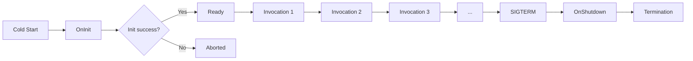

# Core Concepts

This guide explains how `MinimalLambda` stitches together the Lambda lifecycle, dependency injection, middleware, and source generation. Knowing these building blocks makes it easier to reason about performance, testing, and extensibility as your functions grow.

## The Lambda Lifecycle

An execution environment progresses through distinct stages. `MinimalLambda` exposes each one so you can opt into work at the right time.

```
Cold Start → OnInit → Invocation 1..N → OnShutdown → Termination
```

### OnInit (Cold Start)

OnInit handlers run once when AWS boots a new execution environment.

**Characteristics:**

- Executes before the first invocation shares its CPU slice, so keep work short.
- Each handler receives its own scoped `IServiceProvider`, even though the invocation pipeline has not started yet.
- Multiple handlers run concurrently via `Task.WhenAll`.
- Returning `bool`/`Task<bool>` is optional. If you return a value, `false` tells the host to abort startup; omitting the return value (or returning `Task`) implies success.
- Exceptions are aggregated and bubble to AWS so the container never serves traffic.

**Great for:**

- Hydrating caches or distributed clients.
- Clearing Lambda console formatting via `LambdaHostOptions.ClearLambdaOutputFormatting` when you use your own logging pipeline.
- Running migrations or priming configuration secrets.

```csharp title="Program.cs" linenums="1"
lambda.OnInit(async (
    ICache cache,
    ILogger<Program> logger,
    CancellationToken ct
) =>
{
    logger.LogInformation("Warming cache before first invocation");
    await cache.PopulateAsync(ct);
    return true; // omit when you do not need to signal failure explicitly
});
```

### Invocation Pipeline

Every event runs through the middleware pipeline and handler you registered with `MapHandler`. `MinimalLambda` creates a scoped service provider, sets up features, and links the cancellation token to the Lambda timeout.

**Invocation steps:**

1. Lambda runtime delivers the JSON payload.
2. The generated handler deserializes it (if you marked a parameter with `[FromEvent]`).
3. `MinimalLambda` creates a scoped `IServiceProvider` for the invocation.
4. Middleware executes in the order it was registered.
5. Your handler runs and can resolve services/contexts from DI.
6. The response is captured through `IResponseFeature<T>` and serialized via the configured `ILambdaSerializer`.
7. The invocation scope is disposed.

### OnShutdown (Teardown)

AWS sends SIGTERM before reclaiming the execution environment. OnShutdown handlers allow you to flush telemetry or dispose expensive resources.

**Characteristics:**

- Runs once per environment when shutdown begins (timeout defined by `LambdaHostOptions.ShutdownDuration - ShutdownDurationBuffer`).
- Each handler executes in its own fresh scope, so scoped services remain usable even while no invocation is active.
- Handlers run concurrently; long-running work can still time out if it exceeds the remaining shutdown window.
- Use structured logging inside the handler—any exception is aggregated and rethrown from `StopAsync`.

```csharp title="Program.cs" linenums="1"
lambda.OnShutdown(async (
    ITelemetrySink telemetry,
    ILogger<Program> logger,
    CancellationToken ct
) =>
{
    try
    {
        await telemetry.FlushAsync(ct);
        logger.LogInformation("Telemetry flushed before shutdown");
    }
    catch (Exception ex)
    {
        logger.LogWarning(ex, "Telemetry flush failed; continuing shutdown");
    }
});
```

### Lifecycle Context Access

Both OnInit and OnShutdown handlers support rich dependency injection patterns:

- **Inject services directly**: `(ICache cache, ILogger logger, CancellationToken ct)` – Recommended for most scenarios
- **Access AWS metadata**: `(ILambdaLifecycleContext context)` – When you need environment information like function name, region, memory size, or initialization type
- **Combine both**: `(ILambdaLifecycleContext context, ICache cache)` – Mix context access with direct service injection
- **Use keyed services**: `([FromKeyedServices("key")] IService service)` – Resolve services registered with specific keys

The `ILambdaLifecycleContext` interface provides AWS environment metadata, a `Properties` dictionary for sharing state between handlers, and access to the scoped `ServiceProvider`. See [Lifecycle Management](../guides/lifecycle-management.md) for detailed patterns and examples.

### Lifecycle Timeline



## Dependency Injection Fundamentals

`MinimalLambda` uses the standard `Microsoft.Extensions.DependencyInjection` container. Registrations happen before `builder.Build()`, and the framework aligns service lifetimes with the Lambda lifecycle.

| Lifetime  | Created                              | Disposed                                  | Use for                                     |
|-----------|--------------------------------------|-------------------------------------------|---------------------------------------------|
| Singleton | During OnInit (cold start)           | When AWS tears down the execution context | HttpClient, caches, configuration, SDKs     |
| Scoped    | At the beginning of each invocation  | After the invocation completes            | DbContext, repositories, per-request state  |
| Transient | Each time the service is requested   | With the consuming scope                  | Lightweight helpers, formatters, pure logic |

**Tips:**

- Scoped services are the safest default. They do not leak data across invocations.
- Transients behave the same as ASP.NET Core—be mindful of repeated expensive setup.
- Never store scoped services on singletons; resolve them per invocation or pass data explicitly.

### Working with `ILambdaInvocationContext`

Every middleware component and handler can ask for `ILambdaInvocationContext`. Think of it as `HttpContext` for Lambda.

`ILambdaInvocationContext` exposes:

- `ServiceProvider` – the scoped provider for the current invocation.
- `CancellationToken` – fires `InvocationCancellationBuffer` before the hard Lambda timeout.
- `Items` – per-invocation bag for quick data sharing.
- `Properties` – shared dictionary backed by the singleton container (must be thread-safe).
- `Features` – typed capabilities (just like ASP.NET Core features) for accessing the event, response, or custom behaviors without direct DI coupling.

```csharp title="Program.cs" linenums="1"
lambda.MapHandler(async (
    [FromEvent] OrderRequest request,
    ILambdaInvocationContext context,
    IOrderService service,
    CancellationToken ct
) =>
{
    context.Items["RequestId"] = context.AwsRequestId;

    var response = await service.ProcessAsync(request, ct);
    context.Features.Get<IResponseFeature<OrderResponse>>()!.Response = response;

    return response;
});
```

### Parameter Sources

Handlers and lifecycle hooks can request multiple parameter types simultaneously:

- `[FromEvent] T event` – Optional marker for the deserialized payload. Include it only when your Lambda expects input; the generator enforces that at most one parameter carries `[FromEvent]`.
- Services – Any registered service, keyed service (`[FromKeyedServices("key")]`), or options type.
- Context – `ILambdaInvocationContext` or the raw `ILambdaContext` from the AWS SDK.
- `CancellationToken` – Linked to end-to-end timeouts; pass it downstream.

## Middleware Pipeline

Middleware composes the invocation pipeline. Register delegates before `MapHandler`; `MinimalLambda` wraps them around the handler in the order you specify.

```csharp title="Program.cs" linenums="1"
lambda.UseMiddleware(async (context, next) =>
{
    var stopwatch = Stopwatch.StartNew();
    await next(context);
    var logger = context.ServiceProvider.GetRequiredService<ILogger<Program>>();
    logger.LogInformation("Handler finished in {Elapsed}ms", stopwatch.ElapsedMilliseconds);
});

lambda.UseMiddleware(async (context, next) =>
{
    var eventFeature = context.Features.Get<IEventFeature<OrderRequest>>();
    context.Items["OrderId"] = eventFeature?.Event?.Id;
    await next(context);
});

lambda.MapHandler(([FromEvent] OrderRequest order) => new OrderResponse(order.Id, true));
```

**Ordering guidance:**

- Register diagnostics (logging, metrics, tracing) first so they wrap everything else.
- Authentication and authorization should precede validation and business logic.
- Short-circuiting middleware (caching, deduplication) belongs near the handler so it sees the final request context.

## Feature System

Features provide decoupled access to invocation data—mirroring ASP.NET Core’s `HttpContext.Features` and Azure Functions’ binding features. Instead of injecting every dependency everywhere, middleware and handlers trade typed capabilities through the `ILambdaInvocationContext.Features` collection.

Built-in feature types include:

- `IEventFeature<T>` – Holds the deserialized payload (or envelope) so middleware can inspect it.
- `IResponseFeature<T>` – Captures or mutates the handler response before serialization.
- `IInvocationDataFeature` – Exposes raw request/response streams for envelope packages.

Features are created lazily. When `context.Features.Get<T>()` executes, the framework asks each registered `IFeatureProvider` whether it can build the requested type—similar to ASP.NET Core’s feature providers.

```csharp title="Program.cs" linenums="1"
using MinimalLambda.Abstractions.Features;

lambda.UseMiddleware(async (context, next) =>
{
    var logger = context.ServiceProvider.GetRequiredService<ILogger<Program>>();

    if (context.Features.Get<IEventFeature<OrderRequest>>() is { Event: { } request })
        logger.LogInformation("Processing order {OrderId}", request.Id);

    await next(context);

    var responseFeature = context.Features.Get<IResponseFeature<OrderResponse>>();
    if (responseFeature?.Response is { } response)
        logger.LogInformation("Order {OrderId} complete", response.OrderId);
});
```

### Creating Custom Features

Register `IFeatureProvider` implementations to add your own features or override the defaults. The framework ships providers such as `DefaultResponseFeatureProvider<T>` (shown below) and envelope-specific factories.

```csharp title="DefaultResponseFeatureProvider.cs" linenums="1"
using Amazon.Lambda.Core;

namespace MinimalLambda;

/// <summary>
///     Provides a default implementation of <see cref="IResponseFeature" /> for Lambda response
///     serialization. This provider is instantiated by source-generated code to handle Lambda response
///     processing using the specified <see cref="ILambdaSerializer" />.
/// </summary>
public class DefaultResponseFeatureProvider<T>(ILambdaSerializer lambdaSerializer)
    : IFeatureProvider
{
    // ReSharper disable once StaticMemberInGenericType
    private static readonly Type FeatureType = typeof(IResponseFeature);

    /// <inheritdoc />
    public bool TryCreate(Type type, out object? feature)
    {
        feature = type == FeatureType ? new DefaultResponseFeature<T>(lambdaSerializer) : null;

        return feature is not null;
    }
}
```

Feature providers are just services. Register them like any other dependency:

```csharp title="Program.cs" linenums="1"
builder.Services.AddSingleton<IFeatureProvider, CorrelationFeatureProvider>();
```

## Organizing `Program.cs`

Keep supporting types—record definitions, services, and options classes—at the end of `Program.cs` after `await lambda.RunAsync();`. This keeps cold-start logic easy to follow and matches the source generator’s expectations when it scans the file for handler registrations.

## Where to Go Next

- **[Lifecycle Management](../guides/lifecycle-management.md)** – Deep dive into OnInit/OnShutdown configuration and cancellation.
- **[Dependency Injection](../guides/dependency-injection.md)** – Learn about scoped lifetimes, keyed services, and context injection in more detail.
- **[Middleware](../guides/middleware.md)** – Compose reusable pipeline components and feature access patterns.
- **[Handler Registration](../guides/handler-registration.md)** – Understand how source generation enforces handler signatures.
- **[Configuration](../guides/configuration.md)** – Bind `LambdaHostOptions` and application settings from `appsettings.*` or environment variables.
