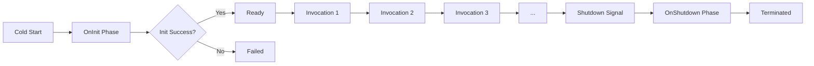
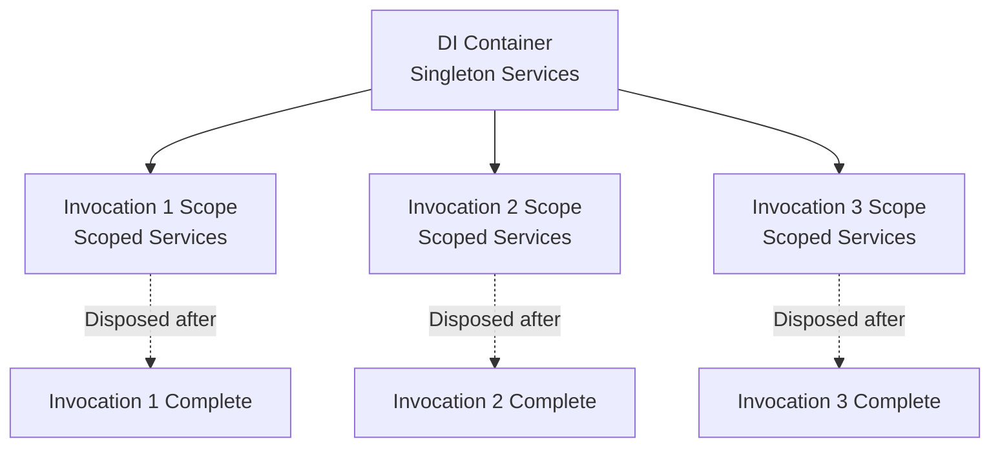
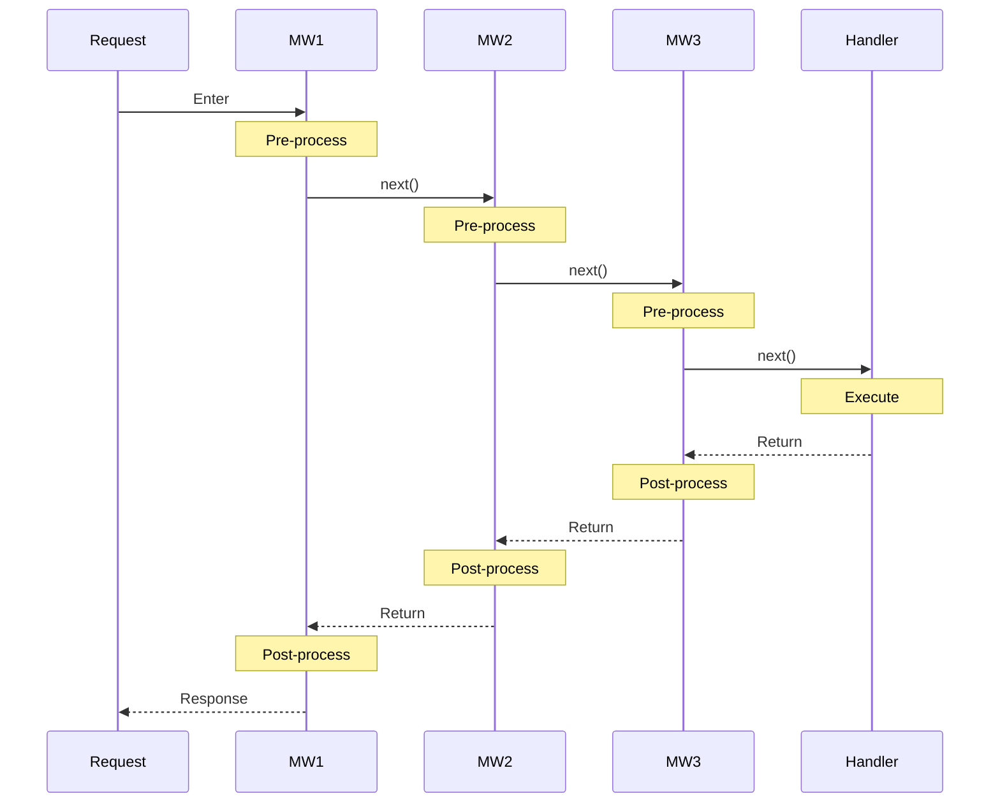

# Core Concepts

This guide explores the fundamental concepts that power aws-lambda-host: the Lambda lifecycle, dependency injection, middleware pipelines, handler registration, and source generation. Understanding these concepts will help you build robust, maintainable Lambda functions.

## Lambda Lifecycle

AWS Lambda functions go through three distinct phases during their execution. Understanding these phases is crucial for optimizing performance and managing resources effectively.

### The Three Phases

#### 1. OnInit Phase (Cold Start)

The OnInit phase runs **once** when a Lambda container starts (cold start). This is your opportunity to perform expensive setup operations that can be reused across multiple invocations.

**Characteristics:**

- Runs only once per container lifecycle
- Singleton services are created during this phase
- Exceptions here prevent the Lambda from starting
- Should complete quickly to minimize cold start time

**Perfect for:**

- Opening database connections
- Loading configuration
- Warming caches
- Initializing HTTP clients
- Setting up telemetry

**Example:**

```csharp
lambda.OnInit(async (services, cancellationToken) =>
{
    var cache = services.GetRequiredService<ICache>();
    await cache.WarmupAsync(cancellationToken);
    Console.WriteLine("Cache warmed up successfully");
    return true; // Return false to abort startup
});
```

#### 2. Invocation Phase

The Invocation phase runs **for each Lambda event**. This is where your business logic executes.

**Characteristics:**

- Runs for every invocation
- New DI scope created per invocation
- Scoped services are instantiated
- Handler executes with injected dependencies
- Exceptions are returned as error responses

**What happens:**

1. Lambda Runtime receives event
2. Event is deserialized to your model
3. New DI scope created
4. Middleware pipeline executes
5. Handler executes
6. Response serialized to JSON
7. DI scope disposed

#### 3. OnShutdown Phase

The OnShutdown phase runs **once** before the Lambda container terminates. Use this for cleanup and flushing data.

**Characteristics:**

- Runs once before container shutdown
- Limited time window (configurable, default 500ms with a 50ms safety buffer)
- Perfect for flushing metrics, logs, or buffers
- Services are still available for injection

By default `LambdaHostOptions` sets `ShutdownDuration` to `ShutdownDuration.ExternalExtensions` (500ms) and subtracts `ShutdownDurationBuffer` (50ms). Increase those values if your cleanup needs a longer runway.

**Perfect for:**

- Flushing telemetry data
- Closing database connections
- Final cleanup operations
- Logging shutdown events

**Example:**

```csharp
lambda.OnShutdown(async (services, cancellationToken) =>
{
    var metrics = services.GetRequiredService<IMetricsPublisher>();
    await metrics.FlushAsync(cancellationToken);
    Console.WriteLine("Metrics flushed before shutdown");
});
```

### Lifecycle Timeline



### Complete Lifecycle Example

```csharp
using System;
using AwsLambda.Host.Builder;
using Microsoft.Extensions.DependencyInjection;
using Microsoft.Extensions.Hosting;

var builder = LambdaApplication.CreateBuilder();

// Register services
builder.Services.AddSingleton<ICache, MemoryCache>();
builder.Services.AddScoped<IOrderRepository, OrderRepository>();

var lambda = builder.Build();

// OnInit - runs once on cold start
lambda.OnInit(async (services, cancellationToken) =>
{
    Console.WriteLine("=== INIT PHASE START ===");
    var cache = services.GetRequiredService<ICache>();
    await cache.WarmupAsync(cancellationToken);
    Console.WriteLine("=== INIT PHASE COMPLETE ===");
    return true;
});

// Handler - runs for each invocation
lambda.MapHandler(([Event] Order order) =>
{
    Console.WriteLine($"=== INVOCATION: Order {order.Id} ===");
    return new OrderResponse(order.Id, true);
});

// OnShutdown - runs once before termination
lambda.OnShutdown(async (services, cancellationToken) =>
{
    Console.WriteLine("=== SHUTDOWN PHASE START ===");
    var cache = services.GetRequiredService<ICache>();
    await cache.FlushAsync(cancellationToken);
    Console.WriteLine("=== SHUTDOWN PHASE COMPLETE ===");
});

await lambda.RunAsync();
```

!!! tip "Lifecycle Timeouts"
    You can configure timeout durations using `LambdaHostOptions`:
    ```csharp
    builder.Services.ConfigureLambdaHostOptions(options =>
    {
        options.InitTimeout = TimeSpan.FromSeconds(10);
        options.ShutdownDuration = TimeSpan.FromSeconds(5);
    });
    ```

## Dependency Injection

Dependency injection (DI) is a core feature of aws-lambda-host. It enables testable, maintainable code by managing dependencies through a service container.

### Service Lifetimes

`aws-lambda-host` uses the standard `Microsoft.Extensions.DependencyInjection` container, so you can register **singleton**, **scoped**, and **transient** services. Lambda's execution model makes singleton and scoped the most common choices, but transients work too when you need a fresh instance every time a dependency is resolved.

#### Singleton (Container Level)

Singleton services are created **once** during the OnInit phase and **reused across all invocations**.

**Characteristics:**
- Created during OnInit
- Shared across all invocations
- Must be thread-safe
- Efficient for shared resources

**Perfect for:**
- HTTP clients (HttpClient, HttpClientFactory)
- Caches and in-memory stores
- Configuration objects
- Database connection pools
- Stateless services

**Example:**

```csharp
builder.Services.AddHttpClient(); // registers IHttpClientFactory + typed clients
builder.Services.AddSingleton<ICache, MemoryCache>();
builder.Services.AddSingleton<IConfiguration>(builder.Configuration);
```

!!! warning "Thread Safety Required"
    Singleton services must be thread-safe because they can be accessed by concurrent invocations.

#### Scoped (Invocation Level)

Scoped services are created **once per invocation** and **disposed after the invocation completes**.

**Characteristics:**
- Created when invocation starts
- Isolated between invocations
- Automatically disposed after invocation
- Can maintain per-request state

**Perfect for:**
- Database contexts (Entity Framework DbContext)
- Repositories with invocation-specific state
- Unit of Work patterns
- Request-specific loggers
- Transaction managers

**Example:**

```csharp
builder.Services.AddScoped<IOrderRepository, OrderRepository>();
builder.Services.AddScoped<IUnitOfWork, UnitOfWork>();
builder.Services.AddScoped<IRequestLogger, RequestLogger>();
```

#### Transient (Per Resolve)

Transient services are created **every time** they are requested from the container.

**Characteristics:**
- New instance per resolution (even within the same invocation)
- Great for lightweight, stateless helpers
- Avoid expensive setup logic here—prefer scoped/singleton for that

**Use carefully for:**
- Simple mappers/formatters
- Stateless validators
- Small wrappers around third-party SDK calls

Register them the same way you would in ASP.NET Core:

```csharp
builder.Services.AddTransient<IIdGenerator, GuidIdGenerator>();
```

### DI Scope Visualization



### Injectable Parameters

Handlers can inject various types of parameters:

| Parameter Type | Description | Attribute Required |
|---------------|-------------|-------------------|
| Event Model | The Lambda event (your custom type) | `[Event]` |
| Registered Services | Any service registered in DI container | No |
| `ILambdaHostContext` | Framework context with Lambda metadata | No |
| `CancellationToken` | For cancellation and timeout handling | No |

If your handler doesn't need an event payload, simply leave the `[Event]` row out of the parameter list and inject only the services you need.

**Example:**

```csharp
lambda.MapHandler(async (
    [Event] Order order,                  // Lambda event (required)
    IOrderService orderService,           // Registered service
    ICache cache,                          // Another service
    ILambdaHostContext context,           // Framework context
    CancellationToken cancellationToken   // Cancellation token
) =>
{
    // Access Lambda metadata
    context.Items["OrderId"] = order.Id;
    context.Items["StartTime"] = DateTime.UtcNow;

    // Check cache
    if (cache.TryGet(order.Id, out var cached))
        return cached;

    // Process with cancellation support
    var result = await orderService.ProcessAsync(order, cancellationToken);

    // Update cache
    cache.Set(order.Id, result);

    return result;
});
```

### Service Registration Patterns

```csharp
var builder = LambdaApplication.CreateBuilder();

// === Singleton Services (shared) ===
builder.Services.AddHttpClient();
builder.Services.AddSingleton<ICache, MemoryCache>();

// Singleton with factory
builder.Services.AddSingleton<IConnectionPool>(sp =>
    new ConnectionPool(sp.GetRequiredService<IConfiguration>())
);

// === Scoped Services (per invocation) ===
builder.Services.AddScoped<IOrderRepository, OrderRepository>();
builder.Services.AddScoped<IUnitOfWork, UnitOfWork>();

// Scoped with interface injection
builder.Services.AddScoped<IRequestContext>(sp =>
    new RequestContext(sp.GetRequiredService<ILambdaHostContext>())
);

// === Configuration ===
builder.Services.Configure<AppOptions>(
    builder.Configuration.GetSection("AppSettings")
);
```

## Middleware Pipeline

Middleware provides a way to compose request processing logic in a pipeline. Each middleware can execute code before and after the next middleware (or handler) in the pipeline.

### How Middleware Works

Middleware forms a chain where each component can:

1. **Pre-process**: Execute logic before the handler
2. **Invoke next**: Call the next middleware/handler
3. **Post-process**: Execute logic after the handler

### Basic Middleware Pattern

```csharp
lambda.UseMiddleware(async (context, next) =>
{
    // === PRE-PROCESSING ===
    // Runs BEFORE the handler
    Console.WriteLine("Before handler execution");
    var stopwatch = Stopwatch.StartNew();

    try
    {
        // === CALL NEXT MIDDLEWARE/HANDLER ===
        await next(context);

        // === POST-PROCESSING (Success) ===
        // Runs AFTER the handler (success path)
        stopwatch.Stop();
        Console.WriteLine($"Handler succeeded in {stopwatch.ElapsedMilliseconds}ms");
    }
    catch (Exception ex)
    {
        // === POST-PROCESSING (Error) ===
        // Runs AFTER the handler (error path)
        stopwatch.Stop();
        Console.WriteLine($"Handler failed after {stopwatch.ElapsedMilliseconds}ms: {ex.Message}");
        throw; // Re-throw to propagate error
    }
});
```

### Multiple Middleware Execution Order

Middleware executes in a **nested** fashion—like Russian dolls:

```csharp
// Register middleware in order
lambda.UseMiddleware(/* MW1: Logging */);
lambda.UseMiddleware(/* MW2: Metrics */);
lambda.UseMiddleware(/* MW3: Validation */);
lambda.MapHandler(/* Handler */);
```

**Execution flow:**



### Middleware Use Cases

#### 1. Logging Middleware

```csharp
lambda.UseMiddleware(async (context, next) =>
{
    Console.WriteLine($"[{DateTime.UtcNow:yyyy-MM-dd HH:mm:ss}] Request started");
    await next(context);
    Console.WriteLine($"[{DateTime.UtcNow:yyyy-MM-dd HH:mm:ss}] Request completed");
});
```

#### 2. Timing/Performance Middleware

```csharp
lambda.UseMiddleware(async (context, next) =>
{
    var stopwatch = Stopwatch.StartNew();
    await next(context);
    stopwatch.Stop();

    Console.WriteLine($"Execution time: {stopwatch.ElapsedMilliseconds}ms");

    if (stopwatch.ElapsedMilliseconds > 1000)
        Console.WriteLine("WARNING: Slow execution detected");
});
```

#### 3. Error Handling Middleware

```csharp
lambda.UseMiddleware(async (context, next) =>
{
    try
    {
        await next(context);
    }
    catch (ValidationException ex)
    {
        Console.WriteLine($"Validation error: {ex.Message}");
        // Handle validation errors
        throw;
    }
    catch (Exception ex)
    {
        Console.WriteLine($"Unexpected error: {ex}");
        // Log to monitoring service
        throw;
    }
});
```

#### 4. Correlation ID Middleware

```csharp
lambda.UseMiddleware(async (context, next) =>
{
    var correlationId = Guid.NewGuid().ToString();
    context.Items["CorrelationId"] = correlationId;
    Console.WriteLine($"Correlation ID: {correlationId}");

    await next(context);
});
```

### Middleware vs Handlers Comparison

| Feature | Middleware | Handler |
|---------|-----------|---------|
| **Execution** | Every invocation | Single invocation only |
| **Parameters** | `ILambdaHostContext`, `Func<Task> next` | `[Event]` + Services |
| **Return Type** | `void` or `Task` | Event response type |
| **Purpose** | Cross-cutting concerns | Business logic |
| **Count** | Multiple (forms pipeline) | One per Lambda |
| **When to Use** | Logging, metrics, validation | Domain logic |

## Handler Registration

Handlers are where your business logic lives. The framework uses source generation to create optimized, type-safe handlers.

### Basic Handler

The simplest handler takes an input and returns an output:

```csharp
lambda.MapHandler(([Event] string input) => input.ToUpper());
```

### Handler with Services

Inject services directly into your handler:

```csharp
lambda.MapHandler(([Event] Order order, IOrderService service) =>
    service.Process(order)
);
```

### Handler with Multiple Dependencies

Inject as many services as you need:

```csharp
lambda.MapHandler(([Event] Order order,
                  IOrderService orderService,
                  IInventoryService inventoryService,
                  IPaymentService paymentService) =>
{
    // All services are automatically injected
    var inventory = inventoryService.CheckAvailability(order);
    var payment = paymentService.ProcessPayment(order);
    return orderService.FulfillOrder(order, inventory, payment);
});
```

### Async Handlers

Use async/await for I/O operations:

```csharp
lambda.MapHandler(async ([Event] Order order,
                         IOrderRepository repository,
                         CancellationToken cancellationToken) =>
{
    var result = await repository.SaveAsync(order, cancellationToken);
    return new OrderResponse(result.Id, true);
});
```

### Handler with Context

Access Lambda context information:

```csharp
lambda.MapHandler(([Event] Request request, ILambdaHostContext context) =>
{
    // Store metadata in context items
    context.Items["RequestId"] = request.Id;
    context.Items["ProcessedAt"] = DateTime.UtcNow;

    // Process request...
    return new Response("Success");
});
```

### The [Event] Attribute

Use `[Event]` to tell the source generator which parameter should receive the deserialized Lambda payload. Handlers can have zero or one `[Event]` parameters:

- ✅ Mark exactly one parameter if you want the framework to deserialize the incoming event.
- ✅ Omit the attribute entirely for DI-only handlers (scheduled jobs, Queue pollers, etc.). The parameter list can consist solely of injected services.
- ❌ Do not decorate multiple parameters—the generator emits `LH0002` if you try.

If you accidentally leave `[Event]` off a parameter that should receive the payload, the framework assumes it's a DI service and no event data is bound, so you'll spot the issue quickly during testing.

**Examples:**

```csharp
// Typical case: bind the event payload
lambda.MapHandler(([Event] Order order, IService service) => service.Process(order));

// DI-only handler: no event payload required
lambda.MapHandler((IMaintenanceJob job, ILogger logger) => job.RunAsync(logger));

// Compile-time error: multiple [Event] attributes
lambda.MapHandler(([Event] Order order, [Event] string id) => { ... });
```

## Source Generation

aws-lambda-host uses C# source generators and interceptors to optimize Lambda performance at compile time.

### What Happens at Compile Time

When you write:

```csharp
lambda.MapHandler(([Event] Order order, IOrderService service) =>
    service.Process(order)
);
```

The source generator:

1. **Analyzes** the handler signature during compilation
2. **Validates** that `[Event]` is used correctly
3. **Generates** deserialization code for the Order type
4. **Generates** dependency injection resolution code
5. **Injects** optimized code via interceptors

### Benefits

#### Zero Runtime Reflection

Traditional frameworks use reflection to inspect types and resolve dependencies at runtime. Source generation moves this to compile time.

**Result**: Faster execution, especially during cold starts.

#### AOT Compilation Ready

Source generation enables Native AOT compilation because all type information is resolved at compile time.

**Result**: Smallest possible package size and fastest cold starts.

#### Compile-Time Errors

Type mismatches and configuration errors are caught during compilation, not at runtime.

**Result**: Fewer production bugs and faster feedback during development.

#### Better Performance

Generated code is optimized specifically for your handler signature.

**Result**: Minimal overhead, maximum throughput.

### Source Generation Example

Your code:

```csharp
lambda.MapHandler(([Event] Order order, IOrderService service) =>
    service.Process(order)
);
```

Generated code (simplified):

```csharp
// Generated by source generator
private static async Task HandleInvocation(
    Stream inputStream,
    IServiceProvider services)
{
    // Deserialize event (no reflection)
    var order = JsonSerializer.Deserialize<Order>(inputStream);

    // Resolve services (no reflection)
    var service = services.GetRequiredService<IOrderService>();

    // Execute handler
    var result = service.Process(order);

    // Serialize response
    return JsonSerializer.Serialize(result);
}
```

!!! info "Transparent Optimization"
    You don't need to think about source generation—it just works. Write clean, simple handler code and let the framework optimize it.

## Putting It All Together

Here's a complete example demonstrating all core concepts:

```csharp
using System;
using System.Diagnostics;
using System.Threading;
using System.Threading.Tasks;
using AwsLambda.Host.Builder;
using AwsLambda.Host.Core;
using Microsoft.Extensions.DependencyInjection;
using Microsoft.Extensions.Hosting;

// === SETUP ===
var builder = LambdaApplication.CreateBuilder();

// Register services with appropriate lifetimes
builder.Services.AddSingleton<ICache, MemoryCache>(); // Shared across invocations
builder.Services.AddScoped<IOrderRepository, OrderRepository>(); // Per invocation

var lambda = builder.Build();

// === LIFECYCLE: OnInit (runs once) ===
lambda.OnInit(
    async (services, cancellationToken) =>
    {
        Console.WriteLine("=== Initializing Lambda ===");
        var cache = services.GetRequiredService<ICache>();
        await cache.WarmupAsync(cancellationToken);
        Console.WriteLine("=== Initialization Complete ===");
        return true;
    }
);

// === MIDDLEWARE 1: Logging ===
lambda.UseMiddleware(
    async (context, next) =>
    {
        Console.WriteLine($"[{DateTime.UtcNow}] Request started");
        await next(context);
        Console.WriteLine($"[{DateTime.UtcNow}] Request completed");
    }
);

// === MIDDLEWARE 2: Timing ===
lambda.UseMiddleware(
    async (context, next) =>
    {
        var stopwatch = Stopwatch.StartNew();
        await next(context);
        stopwatch.Stop();
        Console.WriteLine($"Duration: {stopwatch.ElapsedMilliseconds}ms");
    }
);

// === MIDDLEWARE 3: Correlation ID ===
lambda.UseMiddleware(
    async (context, next) =>
    {
        var correlationId = Guid.NewGuid().ToString();
        context.Items["CorrelationId"] = correlationId;
        Console.WriteLine($"Correlation ID: {correlationId}");
        await next(context);
    }
);

// === HANDLER: Business Logic with DI ===
lambda.MapHandler(
    async (
        [Event] Order order, // Lambda event
        IOrderRepository repository, // Scoped service
        ICache cache, // Singleton service
        ILambdaHostContext context, // Framework context
        CancellationToken cancellationToken // Cancellation token
    ) =>
    {
        // Check cache first
        if (cache.TryGet(order.Id, out var cached))
        {
            Console.WriteLine($"Cache hit for order {order.Id}");
            return cached;
        }

        // Process order
        Console.WriteLine($"Processing order {order.Id}");
        var result = await repository.ProcessAsync(order, cancellationToken);

        // Update cache
        cache.Set(order.Id, result);

        return result;
    }
);

// === LIFECYCLE: OnShutdown (runs once) ===
lambda.OnShutdown(
    async (services, cancellationToken) =>
    {
        Console.WriteLine("=== Shutting Down Lambda ===");
        var cache = services.GetRequiredService<ICache>();
        // Flush cache or perform cleanup
        Console.WriteLine("=== Shutdown Complete ===");
    }
);

// === RUN ===
await lambda.RunAsync();

// === MODELS ===
public record Order(string Id, decimal Amount);

public record OrderResult(string OrderId, bool Success);

// === SERVICES ===
public interface ICache
{
    Task WarmupAsync(CancellationToken ct);
    bool TryGet(string key, out OrderResult value);
    void Set(string key, OrderResult value);
}

public interface IOrderRepository
{
    Task<OrderResult> ProcessAsync(Order order, CancellationToken ct);
}
```

## Key Takeaways

Now you understand the core concepts of aws-lambda-host:

1. **Lambda Lifecycle**
   - OnInit runs once on cold start (setup)
   - Invocation runs for each event (business logic)
   - OnShutdown runs once before termination (cleanup)

2. **Dependency Injection**
   - Singleton: Created once, shared across invocations (must be thread-safe)
   - Scoped: Created per invocation, isolated and disposed after

3. **Middleware Pipeline**
   - Executes before and after handlers
   - Perfect for cross-cutting concerns
   - Composes into a nested pipeline

4. **Handler Registration**
   - Use `[Event]` to mark the Lambda event parameter
   - Inject services directly into handlers
   - Framework resolves dependencies automatically

5. **Source Generation**
   - Compile-time code generation
   - Zero runtime reflection
   - AOT compilation ready
   - Compile-time validation

### Explore Further

- **[Middleware Guide](/guides/middleware.md)** – Advanced middleware patterns
- **[Dependency Injection Guide](/guides/dependency-injection.md)** – DI best practices
- **[Lifecycle Management](/guides/lifecycle-management.md)** – Deep dive into lifecycle hooks
- **[Handler Registration](/guides/handler-registration.md)** – Advanced handler patterns
- **[Source Generators](/advanced/source-generators.md)** – How source generation works internally
