# Your First Lambda Function

This tutorial walks you through building, testing, and deploying a complete Lambda function using `AwsLambda.Host`. You'll create a greeting service that demonstrates dependency injection, middleware, and type-safe handlers.

## What We'll Build

A greeting service Lambda function with:

- ✅ Strongly-typed request/response models
- ✅ Dependency injection with a custom service
- ✅ Middleware for logging
- ✅ Async/await patterns
- ✅ Local testing
- ✅ AWS deployment

## Prerequisites

Before starting, ensure you've completed the [Installation](installation.md) guide and have:

- `AwsLambda.Host` NuGet package installed
- Project file properly configured
- .NET 8 SDK installed

## Step 1: Define Your Models

Create strongly-typed models for your Lambda's input and output using C# records.

!!! note "Keep supporting types at the bottom"
    Place records, interfaces, and service implementations **after** the main pipeline (after `await lambda.RunAsync();`).
    This keeps startup logic together at the top while still shipping everything as a single file.

Add this code to the end of your `Program.cs`:

```csharp title="Program.cs" linenums="1"
using System;
using System.Text.Json.Serialization;

// Request model - what your Lambda receives
public record GreetingRequest(
    [property: JsonPropertyName("name")] string Name,
    [property: JsonPropertyName("language")] string? Language
);

// Response model - what your Lambda returns
public record GreetingResponse(
    [property: JsonPropertyName("message")] string Message,
    [property: JsonPropertyName("timestamp")] DateTime Timestamp
);
```

!!! tip "Why Records?"
    Records provide immutable data models with built-in equality and deconstruction. They're perfect for Lambda events and responses.

!!! note "JsonPropertyName Attribute"
    The `JsonPropertyName` attribute ensures your JSON property names follow your preferred casing convention (e.g., camelCase for JavaScript clients).

## Step 2: Create a Service Interface

Define an interface for your business logic. This enables dependency injection and testability. Keep
this with your other supporting types at the bottom of `Program.cs`.

```csharp title="Program.cs (continued)"
// Service interface
public interface IGreetingService
{
    string GetGreeting(string name, string? language);
}
```

## Step 3: Implement the Service

Implement your service with the actual greeting logic (also placed after the main pipeline).

```csharp title="Program.cs (continued)"
// Service implementation
public class GreetingService : IGreetingService
{
    private static readonly Dictionary<string, string> Greetings = new()
    {
        { "en", "Hello" },
        { "es", "Hola" },
        { "fr", "Bonjour" },
        { "de", "Guten Tag" },
        { "it", "Ciao" },
        { "ja", "こんにちは" }
    };

    public string GetGreeting(string name, string? language)
    {
        var greeting = Greetings.GetValueOrDefault(language ?? "en", "Hello");
        return $"{greeting}, {name}!";
    }
}
```

## Step 4: Configure the Lambda Application

Set up the Lambda application builder and register your services with dependency injection.

```csharp title="Program.cs (continued)"
using AwsLambda.Host.Builder;
using Microsoft.Extensions.DependencyInjection;
using Microsoft.Extensions.Hosting;
using Microsoft.Extensions.Logging;

// Create the Lambda application builder
var builder = LambdaApplication.CreateBuilder();

// Register the greeting service
builder.Services.AddSingleton<IGreetingService, GreetingService>();

// Build the Lambda application
var lambda = builder.Build();
```

!!! info "Service Lifetime: Singleton"
    We use `AddSingleton` because our `GreetingService` is stateless and can be shared across all invocations. This is more efficient than creating a new instance for each request.

## Step 5: Add Middleware (Optional)

Add middleware to log when requests are received and completed. Middleware runs before and after your handler.

```csharp title="Program.cs (continued)"
// Add logging middleware
lambda.UseMiddleware(
    async (context, next) =>
    {
        var logger = context.ServiceProvider.GetRequiredService<ILogger<GreetingService>>();

        logger.LogInformation("Request received at {Timestamp}", DateTime.UtcNow);
        await next(context);
        logger.LogInformation("Request completed at {Timestamp}", DateTime.UtcNow);
    }
);
```

!!! tip "Middleware Use Cases"
    Middleware is perfect for cross-cutting concerns like logging, metrics, validation, error handling, and authentication.

!!! note "Clear Lambda Output Formatting"
    The .NET Lambda runtime captures standard output/error and re-wraps every line into its own structured log record.
    If you're running locally or relying on a custom logger (Serilog, NLog, etc.), disable that extra formatting so your
    log payloads stay untouched:

    ```csharp title="Program.cs (continued)"
    builder.Services.ConfigureLambdaHostOptions(options =>
    {
        options.ClearLambdaOutputFormatting = true;
    });
    ```

    Prefer configuration files? Set `LambdaHostOptions:ClearLambdaOutputFormatting` to `true` in `appsettings.json` (or any
    supported configuration source) for the same effect. See [Configuration → ClearLambdaOutputFormatting](../guides/configuration.md#clearlambdaoutputformatting)
    for more details.

## Step 6: Register the Handler

Map your handler function with the `[Event]` attribute to mark the Lambda event parameter.

```csharp title="Program.cs (continued)"
// Register the handler with dependency injection
lambda.MapHandler(
    ([Event] GreetingRequest request, IGreetingService service) =>
    {
        var message = service.GetGreeting(request.Name, request.Language);
        return new GreetingResponse(message, DateTime.UtcNow);
    }
);
```

!!! warning "The [Event] Attribute"
    Add `[Event]` to at most one handler parameter to mark it as the deserialized Lambda event. If your handler does not accept an event payload (e.g., scheduled invocations or DI-only inputs), you can omit the attribute entirely.

## Step 7: Run the Lambda

Start the Lambda runtime to listen for invocations.

```csharp title="Program.cs (continued)"
// Run the Lambda function
await lambda.RunAsync();
```

## Complete Program.cs

Here's the complete code all together:

```csharp title="Program.cs" linenums="1"
using System;
using System.Collections.Generic;
using System.Text.Json.Serialization;
using AwsLambda.Host.Builder;
using Microsoft.Extensions.DependencyInjection;
using Microsoft.Extensions.Hosting;
using Microsoft.Extensions.Logging;

// Lambda application setup
var builder = LambdaApplication.CreateBuilder();

builder.Services.AddSingleton<IGreetingService, GreetingService>();

builder.Services.ConfigureLambdaHostOptions(options =>
{
    options.ClearLambdaOutputFormatting = true;
});

var lambda = builder.Build();

// Middleware
lambda.UseMiddleware(
    async (context, next) =>
    {
        var logger = context.ServiceProvider.GetRequiredService<ILogger<GreetingService>>();

        logger.LogInformation("Request received at {Timestamp}", DateTime.UtcNow);
        await next(context);
        logger.LogInformation("Request completed at {Timestamp}", DateTime.UtcNow);
    }
);

// Handler
lambda.MapHandler(
    ([Event] GreetingRequest request, IGreetingService service) =>
    {
        var message = service.GetGreeting(request.Name, request.Language);
        return new GreetingResponse(message, DateTime.UtcNow);
    }
);

// Run
await lambda.RunAsync();

// Request and Response models
public record GreetingRequest(
    [property: JsonPropertyName("name")] string Name,
    [property: JsonPropertyName("language")] string? Language
);

public record GreetingResponse(
    [property: JsonPropertyName("message")] string Message,
    [property: JsonPropertyName("timestamp")] DateTime Timestamp
);

// Service interface
public interface IGreetingService
{
    string GetGreeting(string name, string? language);
}

// Service implementation
public class GreetingService : IGreetingService
{
    private static readonly Dictionary<string, string> Greetings = new()
    {
        { "en", "Hello" },
        { "es", "Hola" },
        { "fr", "Bonjour" },
        { "de", "Guten Tag" },
        { "it", "Ciao" },
        { "ja", "こんにちは" },
    };

    public string GetGreeting(string name, string? language)
    {
        var greeting = Greetings.GetValueOrDefault(language ?? "en", "Hello");
        return $"{greeting}, {name}!";
    }
}
```

## Testing Locally

Before deploying to AWS, test your Lambda function locally using the AWS Lambda Test Tool.

### Install the Lambda Test Tool

Install the tool globally using .NET CLI:

```bash
dotnet tool install -g Amazon.Lambda.TestTool-8.0
```

### Run the Test Tool

Start the test tool from your project directory:

```bash
dotnet lambda-test-tool-8.0
```

This opens a web browser with a testing interface.

### Create a Test Payload

In the test tool, enter this JSON payload:

```json title="Test Payload"
{
  "name": "World",
  "language": "en"
}
```

### Execute and Verify

Click **Execute Function** and verify the response:

```json title="Expected Response"
{
  "message": "Hello, World!",
  "timestamp": "2016-08-12T07:24:18.456Z"
}
```

### Test Different Languages

Try different payloads:

=== "Spanish"

    ```json
    {
      "name": "Mundo",
      "language": "es"
    }
    ```

    Expected: `"message": "Hola, Mundo!"`

=== "French"

    ```json
    {
      "name": "Monde",
      "language": "fr"
    }
    ```

    Expected: `"message": "Bonjour, Monde!"`

=== "Japanese"

    ```json
    {
      "name": "世界",
      "language": "ja"
    }
    ```

    Expected: `"message": "こんにちは, 世界!"`

### Check the Logs

Because middleware uses `ILogger`, the Lambda Test Tool (or CloudWatch Logs) will include entries similar to:

```
info: GreetingService[0]
      Request received at 2018-03-14T09:26:53Z
info: GreetingService[0]
      Request completed at 2018-03-14T09:26:54Z
```

## Deploying to AWS

Now that your Lambda works locally, deploy it to AWS. Choose your preferred deployment method:

=== "AWS SAM"

    ### Create SAM Template

    Create a `template.yaml` file in your project root:

    ```yaml title="template.yaml"
    AWSTemplateFormatVersion: '2010-09-09'
    Transform: AWS::Serverless-2016-10-31
    Description: Greeting Lambda Function

    Resources:
      GreetingFunction:
        Type: AWS::Serverless::Function
        Properties:
          FunctionName: greeting-function
          Handler: bootstrap
          Runtime: provided.al2023
          CodeUri: ./
          MemorySize: 512
          Timeout: 30
          Architectures:
            - x86_64

    Outputs:
      GreetingFunctionArn:
        Description: ARN of the Greeting Lambda Function
        Value: !GetAtt GreetingFunction.Arn
    ```

    ### Build and Deploy

    ```bash
    # Build the Lambda
    sam build

    # Deploy (first time - guided)
    sam deploy --guided

    # Follow prompts:
    # - Stack Name: greeting-lambda-stack
    # - AWS Region: us-east-1 (or your preferred region)
    # - Confirm changes: Y
    # - Allow SAM CLI IAM role creation: Y
    ```

    ### Invoke the Function

    ```bash
    sam local invoke GreetingFunction --event event.json
    ```

    Create `event.json`:

    ```json
    {
      "name": "World",
      "language": "en"
    }
    ```

=== "AWS CDK (C#)"

    ### Install CDK

    ```bash
    npm install -g aws-cdk
    ```

    ### Create CDK Stack

    ```csharp title="GreetingStack.cs"
    using Amazon.CDK;
    using Amazon.CDK.AWS.Lambda;
    using Constructs;

    public class GreetingStack : Stack
    {
        public GreetingStack(Construct scope, string id, IStackProps props = null)
            : base(scope, id, props)
        {
            new Function(this, "GreetingFunction", new FunctionProps
            {
                Runtime = Runtime.PROVIDED_AL2023,
                Handler = "bootstrap",
                Code = Code.FromAsset("./publish"),
                MemorySize = 512,
                Timeout = Duration.Seconds(30),
                FunctionName = "greeting-function"
            });
        }
    }
    ```

    ### Deploy

    ```bash
    # Publish the Lambda
    dotnet publish -c Release

    # Deploy the stack
    cdk deploy
    ```

=== "Manual Deployment"

    ### Publish the Lambda

    ```bash
    dotnet publish -c Release -o ./publish
    ```

    ### Create Deployment Package

    ```bash
    cd publish
    zip -r ../function.zip .
    cd ..
    ```

    ### Create IAM Role

    Create an execution role with basic Lambda permissions in the AWS Console or using AWS CLI.

    ### Deploy with AWS CLI

    ```bash
    aws lambda create-function \
      --function-name greeting-function \
      --runtime provided.al2023 \
      --handler bootstrap \
      --zip-file fileb://function.zip \
      --role arn:aws:iam::YOUR_ACCOUNT_ID:role/lambda-execution-role \
      --timeout 30 \
      --memory-size 512
    ```

    Replace `YOUR_ACCOUNT_ID` with your AWS account ID.

## Invoking the Deployed Function

Test your deployed Lambda function using the AWS CLI:

```bash
# Create test event
echo '{"name":"World","language":"es"}' > event.json

# Invoke the function
aws lambda invoke \
  --function-name greeting-function \
  --payload file://event.json \
  response.json

# View the response
cat response.json
```

Expected output in `response.json`:

```json
{
  "message": "Hola, World!",
  "timestamp": "2016-08-12T07:24:18.456Z"
}
```

## Request Flow Diagram

Here's how a request flows through your Lambda function:

```mermaid
sequenceDiagram
    participant Client
    participant Lambda Runtime
    participant Middleware
    participant Handler
    participant Service

    Client->>Lambda Runtime: GreetingRequest JSON
    Lambda Runtime->>Lambda Runtime: Deserialize to GreetingRequest
    Lambda Runtime->>Middleware: Process Request
    Middleware->>Middleware: Log "Request received"
    Middleware->>Handler: Execute Handler
    Handler->>Service: GetGreeting(name, language)
    Service-->>Handler: "Hello, World!"
    Handler-->>Middleware: GreetingResponse
    Middleware->>Middleware: Log "Request completed"
    Middleware-->>Lambda Runtime: GreetingResponse
    Lambda Runtime->>Lambda Runtime: Serialize to JSON
    Lambda Runtime-->>Client: Response JSON
```



## Common Issues

### Handler Not Found Error

**Error**: `Handler 'bootstrap' not found`

**Solution**: Ensure your project has `<OutputType>Exe</OutputType>` in the `.csproj` file.

### JSON Serialization Error

**Error**: Properties are not being serialized correctly

**Solution**: Verify you've added `[property: JsonPropertyName("...")]` attributes to your record properties.

### Build Errors with [Event] Attribute

**Error**: `The [Event] attribute is not recognized`

**Solution**: Add `using AwsLambda.Host.Builder;` to the top of your file (or fully qualify `[AwsLambda.Host.Builder.Event]`). The attribute ships with the `AwsLambda.Host` package—no additional project configuration is required.

### Timeout Errors

**Error**: Lambda times out during execution

**Solution**:
- Increase timeout in your deployment template (default is 30 seconds)
- Check for blocking operations in your handler
- Ensure async/await is used correctly

### Service Not Injected

**Error**: Service parameter is null in handler

**Solution**: Verify the service is registered in `builder.Services` before calling `builder.Build()`.

## What You've Learned

Congratulations! You've built and deployed a complete Lambda function. You now understand:

- ✅ How to structure Lambda functions with `AwsLambda.Host`
- ✅ Defining strongly-typed request/response models
- ✅ Creating and registering services with dependency injection
- ✅ Adding middleware for cross-cutting concerns
- ✅ Using the `[Event]` attribute for handler parameters
- ✅ Testing locally with the Lambda Test Tool
- ✅ Deploying to AWS with SAM, CDK, or manual methods

## Next Steps

Now that you have a working Lambda function, dive deeper into the framework:

### Learn Core Concepts

**→ [Core Concepts](core-concepts.md)** – Understand the Lambda lifecycle, DI patterns, middleware pipeline, and source generation.

### Explore Advanced Features

- **[Middleware Patterns](../guides/middleware.md)** – Build reusable middleware components
- **[Handler Registration](../guides/handler-registration.md)** – Advanced handler patterns
- **[Testing Strategies](../guides/testing.md)** – Unit and integration testing

### Extend the Framework

- **[Envelopes](../features/envelopes.md)** – Type-safe event handling for SQS, SNS, API Gateway, and more.
- **[OpenTelemetry Integration](../features/open_telemetry.md)** – Add distributed tracing and metrics.
