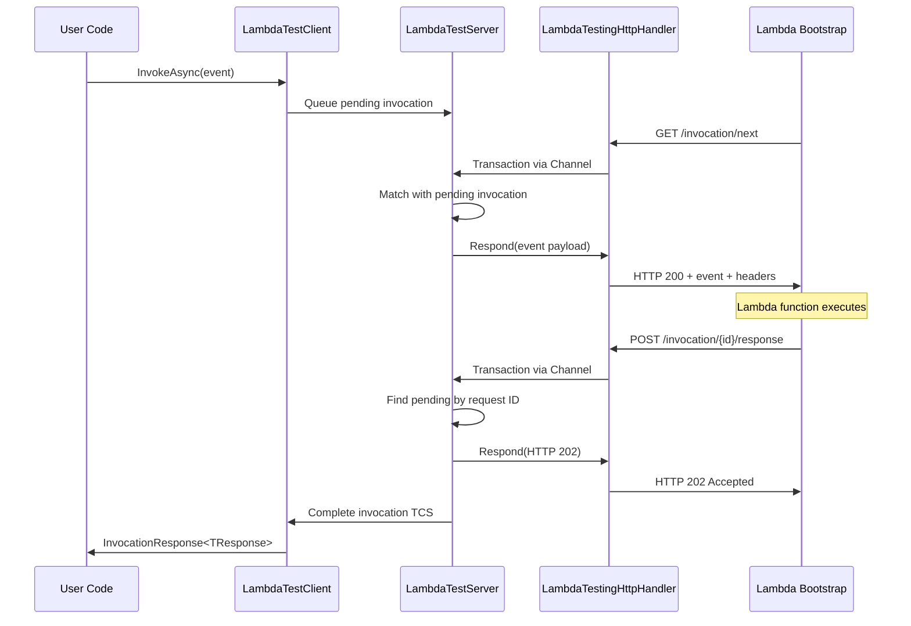

# AwsLambda.Host.Testing

AWS Lambda Local Invocation - Happy Path
```text
========== HTTP REQUEST ==========
GET http://localhost:5050/2018-06-01/runtime/invocation/next
Version: 1.1

Headers:
  Accept: application/json

========== HTTP RESPONSE ==========
Status: 200 OK
Version: 1.1

Headers:
  Date: Thu, 04 Dec 2025 20:40:53 GMT
  Server: Kestrel
  Transfer-Encoding: chunked
  Lambda-Runtime-Deadline-Ms: 1764881754010
  Lambda-Runtime-Aws-Request-Id: 000000000002
  Lambda-Runtime-Trace-Id: 2a159b6d-ca3c-4991-8533-c2b2a8da0640
  Lambda-Runtime-Invoked-Function-Arn: arn:aws:lambda:us-west-2:123412341234:function:Function

Content Headers:
  Content-Type: application/json

Body:
"James"
===================================

========== HTTP REQUEST ==========
POST http://localhost:5050/2018-06-01/runtime/invocation/000000000002/response
Version: 1.1

Headers:
  Accept: application/json

Content Headers:
  Content-Type: application/json

Body:
"Hello James!"

========== HTTP RESPONSE ==========
Status: 202 Accepted
Version: 1.1

Headers:
  Date: Thu, 04 Dec 2025 20:40:53 GMT
  Server: Kestrel
  Transfer-Encoding: chunked

Content Headers:
  Content-Type: application/json; charset=utf-8

Body:
{"status":"success"}
===================================

========== HTTP REQUEST ==========
GET http://localhost:5050/2018-06-01/runtime/invocation/next
Version: 1.1

Headers:
  Accept: application/json


```

AWS Lambda Local Invocation - Error Path
```text
========== HTTP REQUEST ==========
GET http://localhost:5050/2018-06-01/runtime/invocation/next
Version: 1.1

Headers:
  Accept: application/json

========== HTTP RESPONSE ==========
Status: 200 OK
Version: 1.1

Headers:
  Date: Thu, 04 Dec 2025 20:44:06 GMT
  Server: Kestrel
  Transfer-Encoding: chunked
  Lambda-Runtime-Deadline-Ms: 1764881946613
  Lambda-Runtime-Aws-Request-Id: 000000000004
  Lambda-Runtime-Trace-Id: 849e7f8f-6a67-4132-b371-7740c9ad9084
  Lambda-Runtime-Invoked-Function-Arn: arn:aws:lambda:us-west-2:123412341234:function:Function

Content Headers:
  Content-Type: application/json

Body:
2
===================================

========== HTTP REQUEST ==========
POST http://localhost:5050/2018-06-01/runtime/invocation/000000000004/error
Version: 1.1

Headers:
  Lambda-Runtime-Function-Error-Type: JsonSerializerException
  Lambda-Runtime-Function-XRay-Error-Cause:   {  "working_directory": "/Users/jonasha/Repos/CSharp/dotnet-lambda-host/examples/AwsLambda.Host.Examples.Testing/bin/Debug/net10.0",  "exceptions": [     {    "type": "JsonSerializerException",    "message": "Error converting the Lambda event JSON payload to type System.String: The JSON value could not be converted to System.String. Path: $ | LineNumber: 0 | BytePositionInLine: 1.",    "stack":       [      {      "label": "AbstractLambdaJsonSerializer.Deserialize"      },      {      "path": "/Users/jonasha/Repos/CSharp/dotnet-lambda-host/src/AwsLambda.Host/Core/Features/DefaultEventFeature.cs",      "label": "DefaultEventFeature`1.GetEvent",      "line": 28      },      {      "path": "/Users/jonasha/Repos/CSharp/dotnet-lambda-host/src/AwsLambda.Host/Core/Features/DefaultEventFeature.cs",      "label": "DefaultEventFeature`1.AwsLambda.Host.Core.IEventFeature.GetEvent",      "line": 35      },      {      "path": "/Users/jonasha/Repos/CSharp/dotnet-lambda-host/src/AwsLambda.Host/Builder/Middleware/RequestEnvelopeMiddleware.cs",      "label": "<<UseExtractAndPackEnvelope>b__2>d.MoveNext",      "line": 45      },      {      "label": "ExceptionDispatchInfo.Throw"      },      {      "label": "TaskAwaiter.ThrowForNonSuccess"      },      {      "label": "TaskAwaiter.HandleNonSuccessAndDebuggerNotification"      },      {      "path": "/Users/jonasha/Repos/CSharp/dotnet-lambda-host/src/AwsLambda.Host/Runtime/LambdaHandlerComposer.cs",      "label": "<<CreateHandler>g__CreateRequestHandler|0>d.MoveNext",      "line": 78      },      {      "label": "ExceptionDispatchInfo.Throw"      },      {      "path": "/Users/jonasha/Repos/CSharp/dotnet-lambda-host/src/AwsLambda.Host/Runtime/LambdaHandlerComposer.cs",      "label": "<<CreateHandler>g__CreateRequestHandler|0>d.MoveNext",      "line": 84      },      {      "label": "ExceptionDispatchInfo.Throw"      },      {      "label": "TaskAwaiter.ThrowForNonSuccess"      },      {      "label": "TaskAwaiter.HandleNonSuccessAndDebuggerNotification"      },      {      "label": "TaskAwaiter`1.GetResult"      },      {      "label": "<<GetHandlerWrapper>b__0>d.MoveNext"      },      {      "label": "ExceptionDispatchInfo.Throw"      },      {      "label": "TaskAwaiter.ThrowForNonSuccess"      },      {      "label": "TaskAwaiter.HandleNonSuccessAndDebuggerNotification"      },      {      "label": "TaskAwaiter`1.GetResult"      },      {      "label": "<<InvokeOnceAsync>b__0>d.MoveNext"      }      ]    } ],  "paths":     ["/Users/jonasha/Repos/CSharp/dotnet-lambda-host/src/AwsLambda.Host/Core/Features/DefaultEventFeature.cs","/Users/jonasha/Repos/CSharp/dotnet-lambda-host/src/AwsLambda.Host/Builder/Middleware/RequestEnvelopeMiddleware.cs","/Users/jonasha/Repos/CSharp/dotnet-lambda-host/src/AwsLambda.Host/Runtime/LambdaHandlerComposer.cs"    ]  }
  Accept: application/json

Content Headers:
  Content-Type: application/vnd.aws.lambda.error+json

Body:
{
  "errorType": "JsonSerializerException",
  "errorMessage": "Error converting the Lambda event JSON payload to type System.String: The JSON value could not be converted to System.String. Path: $ | LineNumber: 0 | BytePositionInLine: 1.",
  "stackTrace": [
    "at Amazon.Lambda.Serialization.SystemTextJson.AbstractLambdaJsonSerializer.Deserialize[T](Stream requestStream)",
    "at AwsLambda.Host.Core.DefaultEventFeature`1.GetEvent(ILambdaHostContext context) in /Users/jonasha/Repos/CSharp/dotnet-lambda-host/src/AwsLambda.Host/Core/Features/DefaultEventFeature.cs:line 28",
    "at AwsLambda.Host.Core.DefaultEventFeature`1.AwsLambda.Host.Core.IEventFeature.GetEvent(ILambdaHostContext context) in /Users/jonasha/Repos/CSharp/dotnet-lambda-host/src/AwsLambda.Host/Core/Features/DefaultEventFeature.cs:line 35",
    "at AwsLambda.Host.Builder.RequestEnvelopeMiddleware.<>c__DisplayClass1_1.<<UseExtractAndPackEnvelope>b__2>d.MoveNext() in /Users/jonasha/Repos/CSharp/dotnet-lambda-host/src/AwsLambda.Host/Builder/Middleware/RequestEnvelopeMiddleware.cs:line 45",
    "--- End of stack trace from previous location ---",
    "at AwsLambda.Host.Runtime.LambdaHandlerComposer.<>c__DisplayClass6_0.<<CreateHandler>g__CreateRequestHandler|0>d.MoveNext() in /Users/jonasha/Repos/CSharp/dotnet-lambda-host/src/AwsLambda.Host/Runtime/LambdaHandlerComposer.cs:line 78",
    "--- End of stack trace from previous location ---",
    "at AwsLambda.Host.Runtime.LambdaHandlerComposer.<>c__DisplayClass6_0.<<CreateHandler>g__CreateRequestHandler|0>d.MoveNext() in /Users/jonasha/Repos/CSharp/dotnet-lambda-host/src/AwsLambda.Host/Runtime/LambdaHandlerComposer.cs:line 84",
    "--- End of stack trace from previous location ---",
    "at Amazon.Lambda.RuntimeSupport.HandlerWrapper.<>c__DisplayClass19_0.<<GetHandlerWrapper>b__0>d.MoveNext()",
    "--- End of stack trace from previous location ---",
    "at Amazon.Lambda.RuntimeSupport.LambdaBootstrap.<>c__DisplayClass26_0.<<InvokeOnceAsync>b__0>d.MoveNext()"
  ],
  "cause":   {
    "errorType": "JsonException",
    "errorMessage": "The JSON value could not be converted to System.String. Path: $ | LineNumber: 0 | BytePositionInLine: 1.",
    "stackTrace": [
      "at System.Text.Json.ThrowHelper.ReThrowWithPath(ReadStack& state, Utf8JsonReader& reader, Exception ex)",
      "at System.Text.Json.Serialization.JsonConverter`1.ReadCore(Utf8JsonReader& reader, T& value, JsonSerializerOptions options, ReadStack& state)",
      "at System.Text.Json.Serialization.Metadata.JsonTypeInfo`1.Deserialize(Utf8JsonReader& reader, ReadStack& state)",
      "at System.Text.Json.JsonSerializer.ReadFromSpan[TValue](ReadOnlySpan`1 utf8Json, JsonTypeInfo`1 jsonTypeInfo, Nullable`1 actualByteCount)",
      "at Amazon.Lambda.Serialization.SystemTextJson.DefaultLambdaJsonSerializer.InternalDeserialize[T](Byte[] utf8Json)",
      "at Amazon.Lambda.Serialization.SystemTextJson.AbstractLambdaJsonSerializer.Deserialize[T](Stream requestStream)"
    ],
    "cause":     {
      "errorType": "InvalidOperationException",
      "errorMessage": "Cannot get the value of a token type 'Number' as a string.",
      "stackTrace": [
        "at System.Text.Json.ThrowHelper.ThrowInvalidOperationException_ExpectedString(JsonTokenType tokenType)",
        "at System.Text.Json.Utf8JsonReader.GetString()",
        "at System.Text.Json.Serialization.JsonConverter`1.TryRead(Utf8JsonReader& reader, Type typeToConvert, JsonSerializerOptions options, ReadStack& state, T& value, Boolean& isPopulatedValue)",
        "at System.Text.Json.Serialization.JsonConverter`1.ReadCore(Utf8JsonReader& reader, T& value, JsonSerializerOptions options, ReadStack& state)"
      ]
    }
  }
}


========== HTTP RESPONSE ==========
Status: 202 Accepted
Version: 1.1

Headers:
  Date: Thu, 04 Dec 2025 20:44:06 GMT
  Server: Kestrel
  Transfer-Encoding: chunked

Content Headers:
  Content-Type: application/json; charset=utf-8

Body:
{"status":"success"}
===================================

========== HTTP REQUEST ==========
GET http://localhost:5050/2018-06-01/runtime/invocation/next
Version: 1.1

Headers:
  Accept: application/json


```

# In-Memory Lambda Testing Client Implementation Summary

## Overview

This implementation provides an in-memory testing infrastructure for AWS Lambda functions using .NET. It intercepts HTTP requests from the Lambda Bootstrap and allows test code to simulate the Lambda Runtime API without any network calls.

## Core Components

### 1. LambdaHttpTransaction

A simple class that bundles an HTTP request with its response mechanism:

- **Request**: The `HttpRequestMessage` sent by Lambda Bootstrap
- **ResponseTcs**: A `TaskCompletionSource<HttpResponseMessage>` that the test infrastructure completes when ready
- **Convenience methods**: `Respond()` and `Fail()` for easy response handling

The key insight is that each transaction carries its own completion mechanism, providing automatic correlation between requests and responses without needing IDs or separate channels.

### 2. LambdaTestingHttpHandler

A custom `HttpMessageHandler` that intercepts all HTTP calls from Lambda Bootstrap:

- Creates a `Channel<LambdaHttpTransaction>` for outbound communication
- On `SendAsync()`:
  1. Wraps the request in a `LambdaHttpTransaction`
  2. Writes it to the channel
  3. Awaits the transaction's `TaskCompletionSource`
- Handles cancellation by registering a callback that cancels the TCS

This replaces the original two-channel design (request channel + response channel) with a single channel carrying self-contained transactions.

### 3. LambdaTestServer

The intermediary that processes HTTP transactions from the handler:

- Reads transactions from the handler's channel
- Routes requests based on the Lambda Runtime API paths
- Manages queued `/next` requests when no invocations are pending
- Matches response posts back to pending invocations by request ID

### 4. LambdaTestClient

The user-facing API that abstracts away all HTTP details:

- Exposes a clean `InvokeAsync<TEvent, TResponse>()` method
- Communicates with the server to queue invocations
- Tracks pending invocations in a `ConcurrentDictionary` keyed by request ID
- Returns typed `InvocationResponse<TResponse>` to callers

## Request Flow


## Concurrency Handling

The implementation correctly handles multiple concurrent invocations:

1. **Correlation via TCS**: Each `LambdaHttpTransaction` has its own `TaskCompletionSource`, so responses automatically route to the correct caller regardless of completion order.

2. **Request ID tracking**: Each invocation gets a unique GUID. The server tracks pending invocations by this ID and matches Bootstrap's response posts back to the original caller.

3. **Queued /next requests**: If Bootstrap polls for work before any invocations are pending, the request is queued and served when an invocation arrives.

## Key Design Decisions

| Decision | Rationale |
|----------|-----------|
| Single channel with TCS | Eliminates correlation problem inherent in separate request/response channels |
| `TaskCreationOptions.RunContinuationsAsynchronously` | Prevents deadlocks and stack dives when completing the TCS |
| Background processing loop in server | Decouples user's invoke calls from Bootstrap's polling pattern |
| `ConcurrentDictionary` for pending invocations | Thread-safe tracking for concurrent invoke calls |

## Usage Example
```csharp
// Setup
var handler = new LambdaTestingHttpHandler();
var server = new LambdaTestServer(handler);
var client = new LambdaTestClient(server);

server.Start();

// Wire handler to Lambda Bootstrap's HttpClient
// ... bootstrap configuration ...

// Invoke - user only sees events and responses, no HTTP
var response = await client.InvokeAsync<MyEvent, MyResponse>(
    new MyEvent { UserId = 123 });

if (response.IsSuccess)
{
    Console.WriteLine(response.Response.Result);
}
```

## Benefits

- **Clean API**: Users work with typed events and responses, not HTTP
- **Correct concurrency**: Multiple simultaneous invocations work correctly
- **Testable**: No network, no ports, no external dependencies
- **Faithful simulation**: Follows the actual Lambda Runtime API contract
- **Faithful simulation**: Follows the actual Lambda Runtime API contract